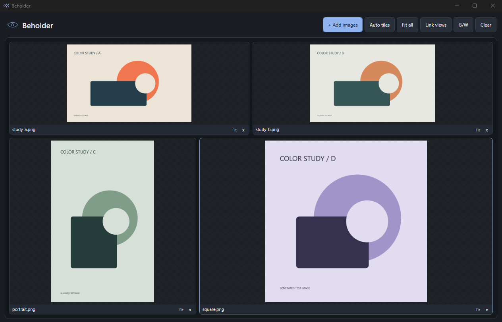

# Beholder

A small, standalone Windows image-comparison app for artists and reviewers: compare references, check perspective and isometric construction, and export the whole canvas as one JPEG. Drop images onto an empty canvas; their tiles rebalance automatically around their proportions. No Hermes integration, accounts, uploads, telemetry, or network access.



## Run

Download the portable Windows ZIP from this repository's **Beholder release**, extract it, and double-click **Beholder.exe**. No installer or administrator privileges are needed. Requires Windows 10/11 x64 with .NET Framework 4.8; there are no additional runtime packages.

The latest checked-in build is also available at `dist/Beholder.exe`, with its SHA-256 in `dist/Beholder.exe.sha256`. Tagged release ZIPs are separate and may contain an older build.

The executable is unsigned. Windows may display a SmartScreen warning for a newly downloaded build; only run a copy obtained from this repository or built from this source.

## Everyday controls

- **Drop files** anywhere, **Add images** / **Ctrl+O**, or **Ctrl+V** to paste an image or copied image files.
- **Auto tiles** follows image proportions. Two images stay side by side. **Equal tiles** uses equally sized comparison cells.
- Resize the window: every tile reflows to fit. Images keep their proportions and are never cropped at Fit.
- Mouse wheel over an image: zoom around the pointer. Drag the image: pan. **Fit all** / **Ctrl+0** resets the views.
- **B/W** / **Ctrl+B** toggles a black-and-white filter for all images, including newly added images. Turning it off restores the original colors; alpha and source files stay untouched.
- **Link views** / **Ctrl+L** synchronizes zoom and normalized image-relative pan. Turn it off for independent inspection.
- Drag a **filename bar** onto another tile to reorder.
- Double-click an image to focus it; double-click again or **Esc** to restore the grid.
- **F11** toggles fullscreen. **Esc** exits fullscreen.
- The tile's **x** or **Delete** removes the selected image. **Clear** / **Ctrl+Shift+X** empties the canvas. Original files are never deleted or written to.
- Dark-only canvas with a subtle checkerboard for transparency. No theme selector or bottom status bar; compact filename strips leave more room for the images.
- Import errors appear briefly over the canvas without reserving layout space. Click an error to dismiss it.
- Hover over a filename for its original pixel dimensions and full filename.

- **Save JPG** / **Ctrl+S** saves every image as a single composite JPEG at the current window resolution, preserving each tile's zoom, pan and the B/W filter. All images are included even while one is focused; captions and overlay markers never appear.
- **Perspective** / **Ctrl+P**: each click places a vanishing point at that spot and instantly draws a horizon plus a full set of X/Y/Z construction lines rising from the bottom of the image to the point; each additional point adds its own converging set (one-point, two-point, three-point…). Drag to move a point, Delete removes the selected point, toggling off keeps your points.
- **Isometric** / **Ctrl+I**: transparent isometric grid with checkerboard overlay on every image. Each click cycles **off → 2:1 → 30° → off**; Ctrl+I toggles on/off directly.
- **Link views** additionally copies the selected image's vanishing points to every image while linked; edits stay in sync.
## Supported inputs and boundaries

PNG, JPEG, BMP, GIF, TIFF and ICO use Windows' built-in image decoders. **WebP is built in**: lossy, lossless, transparency and the first frame of animated WebP are supported without installing a Windows codec. AVIF is optional and requires a compatible Windows imaging codec; unsupported files produce a visible error. SVG, RAW, PSD, PDF and video are not supported.

Animated and multi-page inputs show the first frame/page only. JPEG/TIFF EXIF orientation is applied. WebP ICC and EXIF metadata are not applied in this version; this is a comparison viewer, not a color-proofing tool. Unicode filenames and filenames containing spaces are supported. Dropped folders add supported files from that folder only (not recursively).

This first version is an in-memory workspace: closing it does not save the layout. Image previews are capped at 4096 pixels on their longest edge; the labels retain original dimensions. Zoom magnifies the preview, not a full-resolution pixel editor. There is a 64-image canvas limit, a 200 MB per-file limit and a 100-megapixel source-image limit. Memory usage scales with decoded image sizes.

## Build from source

No SDK download, NuGet restore, Node, browser bundle, or dependency installation is needed. The pinned native WebP decoder is already included as a compressed build resource. The build uses Windows' .NET Framework C# compiler and WPF assemblies.

In PowerShell, from this folder:

```powershell
powershell -NoProfile -ExecutionPolicy Bypass -File .\build.ps1
.\dist\Beholder.exe
```

Build and run the regression checks:

```powershell
powershell -NoProfile -ExecutionPolicy Bypass -File .\build.ps1 -Test
```

Tests use real WPF decoders, real generated image files and a routed FileDrop event through the live window. They write JUnit XML and an actual rendered comparison screenshot under `evidence/`. Generated fixture art is explicitly labelled as test imagery. A routed-event test is not a claim that an Explorer-to-window gesture was physically performed.

## Source map

- `src/Beholder.cs`: native window, image tiles and input interactions.
- `src/Layout.cs`: aspect-aware row partitioning and equal-cell layout.
- `src/ImageLoader.cs`: image decoding, orientation, bounded previews, alpha-preserving grayscale and closed file streams.
- `src/WebPDecoder.cs`: bundled native WebP decoding and animated first-frame composition.
- `tests/Tests.cs`: regression and real-window integration harness.
- `beholder.ico`: original eye icon generated for this app.
- `app.manifest`: non-administrator launch and per-monitor DPI awareness.
- `build.ps1`: reproducible local build and test commands.

## Bundled WebP decoder

The official Google/libwebp **1.6.0 Windows x64** `dwebp.exe` is embedded in the app, compressed. On first WebP use it is unpacked to `%LOCALAPPDATA%/Beholder/codecs/libwebp-1.6.0/`. This is a versioned app cache, not an installer. Its SHA-256 is checked before use; it runs without a shell, console window, network access or administrator privileges. Source images are sent over stdin and decoded PNG pixels return over stdout.

Upstream BSD license, patent grant and author notices are in `third_party/libwebp/`. The portable ZIP includes them. The helper is pinned, not updated automatically. See `third_party/libwebp/NOTICE.md` for provenance and exact hashes.
